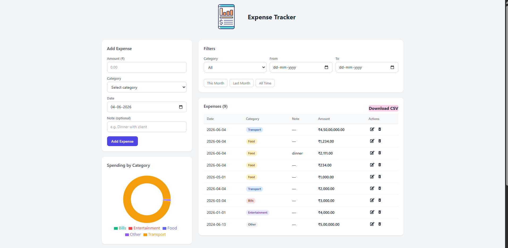
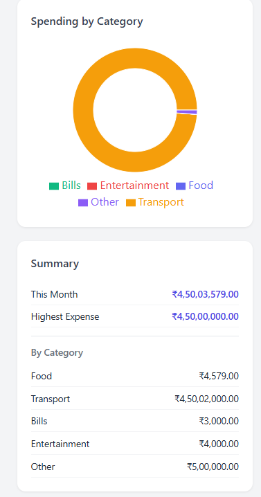

# 💸 Expense Tracker

A full-stack  small scale expense tracking web application built with React and Node.js. Users can log daily spending across categories, filter by date and category, and visualise where their money is going through a summary panel and pie chart.

> Built as part of the Studio Graphene Full Stack Developer Assessment — Exercise 2: Mini Expense Tracker.

---

## 🔗 Live Demo

- **Frontend:** ~ " https://expense-tracker-rho-silk-39.vercel.app/"
- **Backend:** ~ " https://expense-tracker-6z4a.onrender.com/" 

> Note: The backend is hosted on Render's free tier and may take 30–60 seconds to wake up on the first request after a period of inactivity.

---

## UI SCREENSHOTS






## 🛠 Tech Stack

| Layer | Technology | Reason |
|-------|-----------|--------|
| Frontend | React 18 + Vite | Fast dev server, modern React with hooks |
| State Management | React Context API | Lightweight global state without Redux overhead — appropriate for a single-user app |
| Charting | Recharts | Simple, composable React chart components |
| Icons | react-icons | Lightweight icon library |
| Styling | Plain CSS + Tailwind (footer) | CSS for main layout, Tailwind for utility-first component styling |
| Backend | Node.js + Express | Minimal, fast REST API server |
| Storage | JSON file (data.json) | Simple persistence without a database setup — suitable for single-user scope |
| ID Generation | uuid | Guaranteed unique IDs for each expense |
| CSV Download | react-csv | download of expenses locally in csv format |

---

## 🚀 How to Run Locally

> Assumes you have Node.js installed. Clone the repo first.

```bash
git clone https://github.com/AkshGupta007/Expense-Tracker.git
cd expense-tracker
```

### Start the Backend

```bash
cd server
npm install
echo "[]" > Data/data.json
node server.js
```

Ensure `server/Data/data.json` exists and contains [] json or json data in []:


Server runs on `http://localhost:5000`

### Start the Frontend

Open a new terminal:

```bash
cd client
npm install
npm run dev
```

Frontend runs on `http://localhost:5173`
# Markdown
Frontend runs on the URL shown by Vite (typically http://localhost:5173).
If 5173 is already in use, Vite may automatically choose another port such as 5174.

---

## 📁 Project Structure

```
expense-tracker/
├── client/                        # React frontend
│   ├── src/
│   │   ├── components/
│   │   │   ├── ExpenseForm.jsx          # Add / edit expense form with validation
│   │   │   ├── ExpenseTable.jsx         # Expense list with edit and delete actions
│   │   │   ├── Summary.jsx              # Total this month, by category, highest expense
│   │   │   ├── Chart.jsx                # Pie chart of spending by category
│   │   │   ├── FilterBar.jsx            # Category and date range filters
│   │   │   └── Footer.jsx               # Footer with name , Github Repo and contact
│   │   ├── context/
│   │   │   └── ContextApi.jsx           # Global state — expenses, filters, API calls
│   │   ├── utils/
│   │   │   |── formatCurrency.js        # Indian Rupee formatter (en-IN locale)
            ├── ConfirmationModal.jsx    # Delete confirmation modal
            ├── downloadCSV.jsx          # Download button for CSV file
│   │   ├── App.jsx                      # Root layout, edit state management
│   │   ├── App.css                      # Global styles
│   │   └── main.jsx                     # React entry point, wraps app in ExpenseProvider
│   ├── vite.config.js                   # Vite config with /api proxy to backend
│   └── package.json
│
├── server/                              # Node.js + Express backend
│   ├── Controllers/
│   │   └── expenses.js                  # GET, POST, PUT, DELETE handlers
│   ├── Routes/
│   │   └── routes.js                    # Express router — maps endpoints to controllers
│   ├── Data/
│   │   └── data.json                    # JSON file storage (gitignored)
│   ├── server.js                        # Express app setup, middleware, server start
│   └── package.json
│
├── .gitignore
└── README.md
```

---

## 📡 API Documentation

Base URL: `http://localhost:5000/api`

### GET `/expenses`

Returns all expenses, sorted by date (newest first). Supports optional query filters.

| Query Param | Type | Example |
|-------------|------|---------|
| category | string | `Food` |
| startDate | string (YYYY-MM-DD) | `2024-06-01` |
| endDate | string (YYYY-MM-DD) | `2024-06-30` |

**Response `200`**
```json
[
  {
    "id": "f47ac10b-58cc-4372-a567-0e02b2c3d479",
    "amount": 250.00,
    "category": "Food",
    "date": "2024-06-04",
    "note": "Lunch",
    "createdAt": "2024-06-04T10:30:00.000Z"
  }
]
```

---

### POST `/expenses`

Creates a new expense.

**Request Body**
```json
{
  "amount": 250.00,
  "category": "Food",
  "date": "2024-06-04",
  "note": "Lunch"
}
```

**Response `201`** — returns the created expense with generated `id` and `createdAt`.

**Validation errors `400`**
- Amount must be a positive number
- Category must be one of: Food, Transport, Bills, Entertainment, Other
- Date is required and cannot be in the future

---

### PUT `/expenses/:id`

Updates an existing expense by ID.

**Request Body** — same shape as POST

**Response `200`** — returns the updated expense object

**Response `404`** — expense not found

---

### DELETE `/expenses/:id`

Deletes an expense by ID.

**Response `200`**
```json
{ "success": true, "message": "Item deleted successfully" }
```

**Response `404`** — expense not found

---

## ✅ Features Implemented

### Must Have
- ✅ Add expense with amount, category, date, optional note
- ✅ View all expenses sorted by date (newest first)
- ✅ Edit and delete existing expenses
- ✅ Delete confirmation modal
- ✅ Filter by category and date range (This Month, Last Month, All Time, custom)
- ✅ Summary panel — total this month, per category, highest single expense

### Should Have
- ✅ Pie chart showing spending by category (Recharts)
- ✅ Indian Rupee currency formatting (₹1,234.50) using Intl.NumberFormat
- ✅ Form validation — no negative amounts, no future dates, category required

### Bonus
- ✅ Persistence to JSON file — data survives server restarts
- ✅ CSV Export- Allow users to download their filtered expenses as a CSV file.


---

## 🔮 Next Steps / Future Improvements

### Authentication & Multi-User Support
Currently the app assumes a single user with no login. The next step would be to add JWT-based authentication with a signup and login flow. Each expense would be tied to a `userId`, so every user only sees their own data. Libraries like `bcrypt` for password hashing and `jsonwebtoken` for token generation would be used.

### Real Database
The JSON file works for a single user but is not suitable for concurrent multi-user access — simultaneous writes can corrupt the file. Migrating to **SQLite** (via `better-sqlite3`) would be a lightweight first step, and **PostgreSQL** with an ORM like Prisma would be the production-ready choice.

### Budget Limits Per Category
Let users set a monthly budget per category. A visual indicator (progress bar turning red) would show when spending exceeds the limit. This would require a separate `/budgets` API endpoint.

### Pagination
Currently all expenses are fetched at once. For large datasets, server-side pagination with `limit` and `offset` query params would improve performance.

### Tests
A couple of meaningful backend tests using **Jest** or **Vitest** on the controller functions — particularly validating the POST and PUT validation logic — would improve confidence in the API.

---

## 🤖 AI Tool Usage

Claude (Anthropic) was used during development to assist with:
- Initial UI layout and CSS structure
- Tailwind class suggestions for the footer component
- Debugging CORS configuration issues

All code was reviewed, understood, and in many cases modified before being used. Every line in this codebase can be explained and walked through.

---

## 👤 Author

**Aksh Gupta**
- 📧 akshgupta593@gmail.com
- 📞 +91 88006 96298
- 🐙 https://github.com/AkshGupta007/
